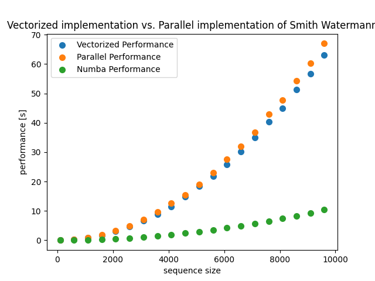

# smith-waterman


## Introduction
This is a repository holding several different efficient implementations of the Smith-Waterman local alignment algorithm.
The algorithm were implemented with python in three different flavors:
1. Exploiting parallel computing
2. Exploiting vectorized computing
3. Exploiting vectorized computing in addition to accelerating performance by using the JIT compiler Numba.

We also provide a comparison between the different implementations.


## Getting Started
First of all, make sure you have conda package manager installed. If not, please refer to the following link:
<link>https://conda.io/projects/conda/en/latest/user-guide/install/index.html</link>
<br><br><br>

Then, please clone the github repository using:
```bash
git clone https://github.com/zuherJahshan/smith-waterman.git
```

After that, you can create the virtual environment and activate it using the following commands:
```bash
conda install --name sw --file requirements.txt
conda activate sw
```

## Basic Usage
This repository implements 3 different flavors of the SW algorithm.
In this section we will present usage cases for each flavor

First of all, define this function whom randomly generates sequences
and generate random sequences:
```python
def generate_random_sequence(length):
    return ''.join(random.choices(string.ascii_uppercase, k=length))

seq1 = generate_random_sequences(length=1000)
seq2 = generate_random_sequences(length=800)
```

Then to use the parallel SW
```python
from parallelSw import *

score_matrix_parallel, max_score_parallel, max_pos_parallel = smith_waterman_parallel(seq1, seq2)
```

Then to use the vectorized SW
```python
from numpySw import *

score_matrix_parallel, max_score_parallel, max_pos_parallel = smith_waterman_vectorized(seq1, seq2)
```

Lastly to use Numba's SW
```python
from numbaSw import *

score_matrix_vectorized, max_score_vectorized, max_pos_vectorized = smith_waterman_numba(seq1, seq2)
```

## Comparison
We provide a performance comparison in the "lab.ipynb" python notebook. Results comparing the flavors:


